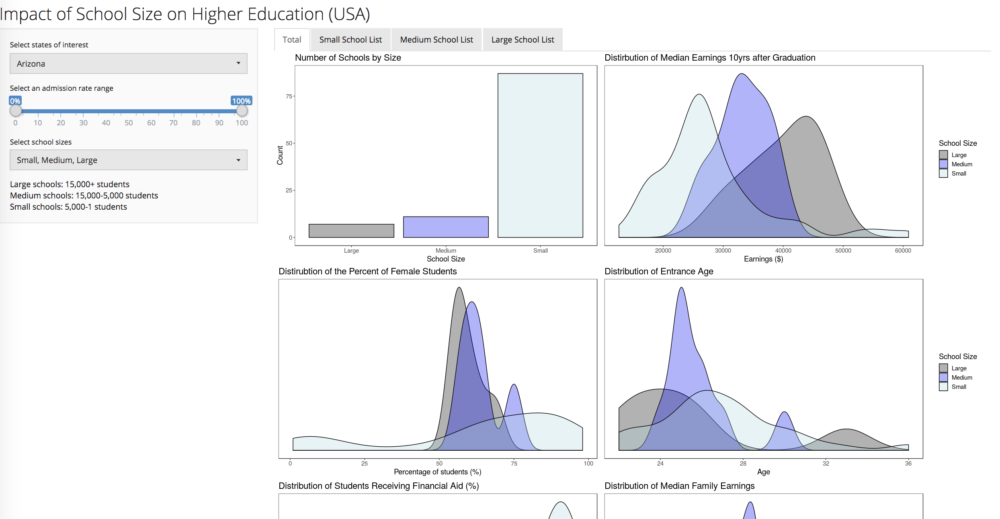
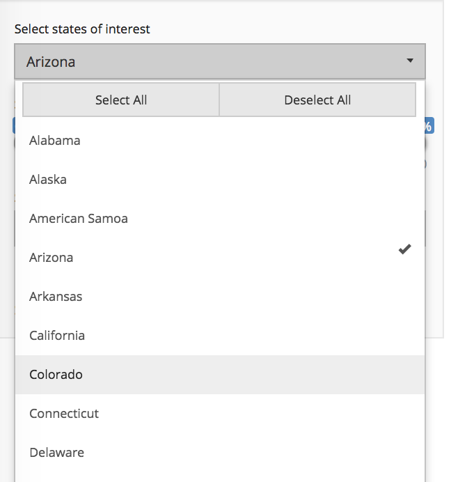
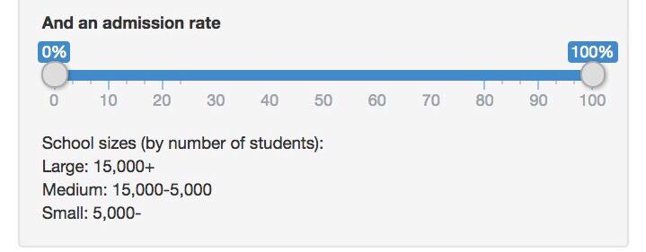
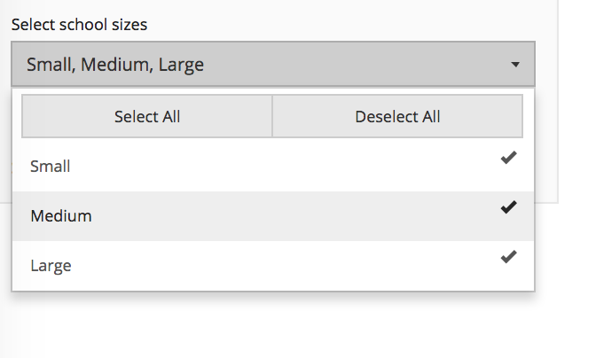

## Impact of School Size on Higher Education

Authors:  
[Sarah Watts](https://github.com/smwatts)   
[Socorro Dominguez](https://github.com/sedv8808)

### README

Look at our [Milestone 3](https://github.com/UBC-MDS/college_scorecard/blob/master/docs/03_milestone3.md)

#### Given Reviews for other repos:
I. We talked to Simran and Sreya about their wine app. 
Our feedback can be found [here](https://github.com/UBC-MDS/DSCI-532-wine-data/issues/14).

II. We also talked to Hayley and Tony about their Boston crime Shiny app.
Our feedback can be found [here](https://github.com/UBC-MDS/DSCI_532-boston-crime-rate/issues/27).

#### College Scorecard

Our deployed Shiny App can be found [here](https://sedv8808.shinyapps.io/College_scorecard/)

We are analyzing the dataset is the "College Scorecard Data" from the US Department of Education. The College Scorecard project is designed to increase transparency and to help students and families compare individual higher education institutions. We think that reading tables can be extremely complicated. Hence, we are designing a Shiny App that users might find friendlier. This app can help people recommend schools or look schools for their own selves.

We are just considering a few parameters for time convenience. However, it would be interesting to add all the other possible visualizations at some point in time.

This project provides data visualizations for the following:
- School Count
- Median Wage 10 years after graduation
- Percentage of Females
- Family Average Income 
- Percentage of students that receive financial aid 
- Entrance Age

These data are provided through federal reporting from institutions in the United States.

## Data

[College Scorecard](https://github.ubc.ca/MDS-2018-19/DSCI_532_viz-2_students/tree/master/release/milestone1/data/scorecard)

[Dictionary](https://github.ubc.ca/MDS-2018-19/DSCI_532_viz-2_students/blob/master/release/milestone1/data/scorecard/dictionary.csv)

## Usage

Visit us [here](https://sedv8808.shinyapps.io/College_scorecard/)

OR 

Clone/download this repo.
Go to the SRC folder
Open and run `app.R`

## Dependencies
You must have R (recommend for latest version) installed sames as the following libraries:
- shiny
- shinyWidgets
- shinythemes 
- tidyverse
- gridExtra
- cowplot
- shinyjs

There are three interactive main features:

1. Ability to select by state(s): this ShinyApp can filter the data for a specify state through a `Select List Input Control`.  

2. If interested in only a range of admission rate, a `slider range bar` is available. 

3. The size of the schools can be selected through a `multi select menu`.

#### Rationale

When developping this app, we wanted to give users the ability to see different statistics around the `College Scorecard` database. Understanding this statistics at glance can help a student identify which school they could attend at more ease. They could also foresee what impact it could have in their lives: seeing the actual median income for families and see how after graduation in a certain state the income increases might motivate people to attend higher education.

We also thought it was meaningful to see how many students actually needed financial aid and based on their future expected wage, if it was empowering for them to pursue higher education. 

It was important for us to divide in school sizes because usually smaller schools do not have the same cost as larger schools (although we do not have the `tuition cost` variable). It is also important to know this because a lot of students might prefer going to a smaller school.

We are also aware that some students might not be willing to relocate, or would just want to relocate to a particular state, so being able to filter by state was also important. 

As for admission rate, some schools are just harder to get into. And some students might aspire to get into those schools. So, they might just be interested in pursuing education there.

## Structure of this repository.
You will find 4 main folders in this repository: 
 - Data (Raw and cleaned data)
 - Docs (Milestone reports)
 - Images (Screenshots that we have taken to showcase the app)
 - SRC (All the scripts we created to run this app, including some previsualizations)

#### Tasks

Look at what we did at [Milestone 3](https://github.com/UBC-MDS/college_scorecard/blob/master/docs/03_milestone3.md):

### Bugs
No plots are displayed when a selection has less than 2 items.

[Milestone 3](https://github.com/UBC-MDS/college_scorecard/releases/tag/V3.0)
[Milestone 2](https://github.com/UBC-MDS/college_scorecard/releases/tag/V2.0)
[Proposal Release](https://github.com/UBC-MDS/college_scorecard/releases/tag/V1.0)
