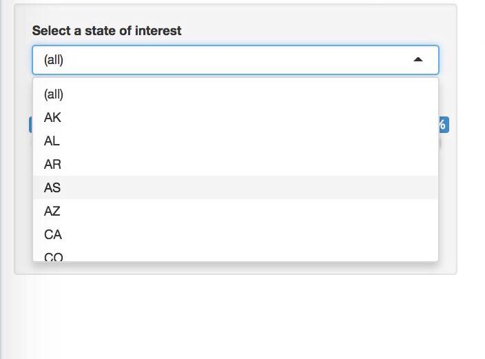
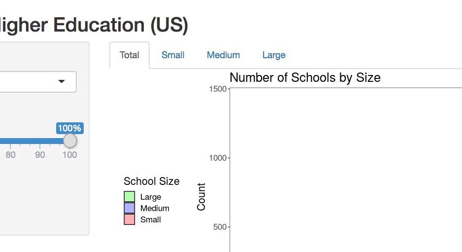
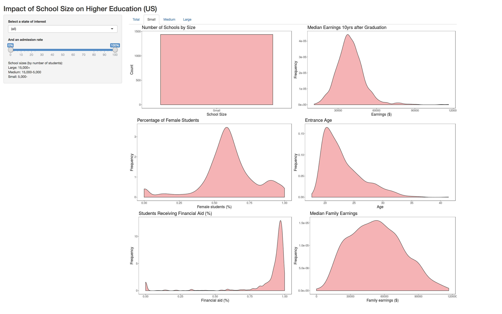
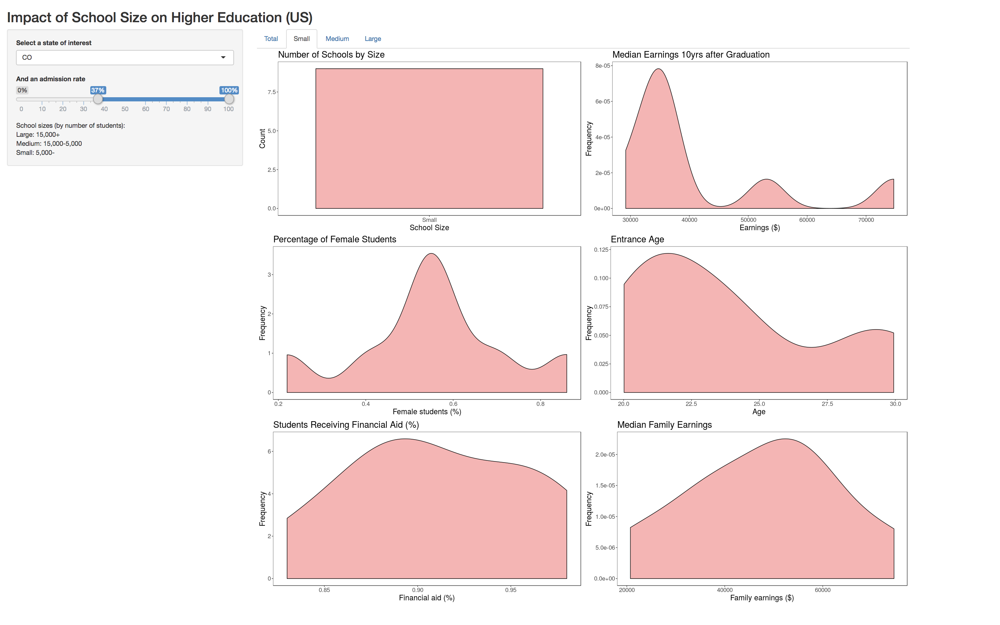

## Impact of School Size on Higher Education

Authors:  
[Sarah Watts](https://github.com/smwatts)   
[Socorro Dominguez](https://github.com/sedv8808)

### Milestone 2

#### Screenshot Demonstration - How does the app work?

Our deployed Shiny App can be found [here](https://sedv8808.shinyapps.io/School_Scorecard_app/)

Six graphs can be seen. Each graph contains different information:

1. Count of Schools
2. Median Earnings 10 years after graduation
3. Percentage of female students
4. Average entrance age
5. Percentage of students receiving financial aid
6. Median income for each student's family. 

All this information is for all the states in the United States and considering an admission rate per school from 0% to 100%

This main tab also represents all schools: 
- Small: Less than 5,000 students
- Medium: Between 5,001 and 15,000
- Large: More than 15,000 students

There are three interactive main features:

1. Ability to filter by state: this ShinyApp can filter the data for a specify state through a `Select List Input Control`.  

2. If interested in only a range of admission rate, a `slider range bar` is available. 

3. The size of the schools can be selected through a `tab menu`.

Here is an example on how the selection works, and changes the graphs according to these selections.

We may be interested in just choosing **Small schools** of **all** the country without any concern about the **admission rate**.

But we may be just interested in the **small schools** in **Colorado** with an admission rate **above 37%**.
Then, the graphs will look like this:

#### Rationale

When developping this app, we wanted to give users the ability to see different statistics around the `College Scorecard` database. Understanding this statistics at glance can help a student identify which school they could attend at more ease. They could also foresee what impact it could have in their lives: seeing the actual median income for families and see how after graduation in a certain state the income increases might motivate people to attend higher education.

We also thought it was meaningful to see how many students actually needed financial aid and based on their future expected wage, if it was empowering for them to pursue higher education. 

It was important for us to divide in school sizes because usually smaller schools do not have the same cost as larger schools (although we do not have the `tuition cost` variable). It is also important to know this because a lot of students might prefer going to a smaller school.

We are also aware that some students might not be willing to relocate, or would just want to relocate to a particular state, so being able to filter by state was also important. 

As in for admission rate, some schools are just harder to get into. And some students might aspire to get into those schools. So, they might just be interested in pursuing education there.

#### Tasks

We did the following tasks for Milestone 2:

1. School Size Summary tab
Create plots according to the schools sizes: Total, Small, Medium, Large

2. Select List Input filter
Creates plots for each of all the 51 states or for the whole country

3. Slider Range Bar
Creates plots for a range in the admission rate.

#### Vision & Next Steps
For next milestone, we want to add an `Interactive Table` with the Data Frame information so that the user can also explore the information by school. There are over 8,000 schools, and we think the user might also be interested in knowing the names of the schools. 

One feature that we thought to implement but could not due to time constraints, were `Selection buttons` in order to just do the plots of interest for the user. 

### Bugs

So far, no bugs detected. 

[Proposal Release](https://github.com/UBC-MDS/college_scorecard/releases/tag/V1.0)