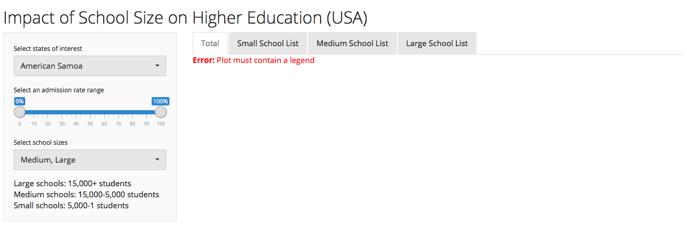
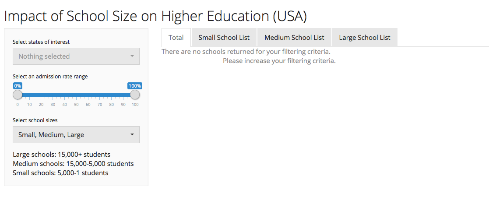
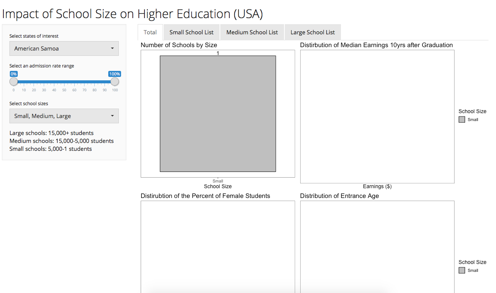
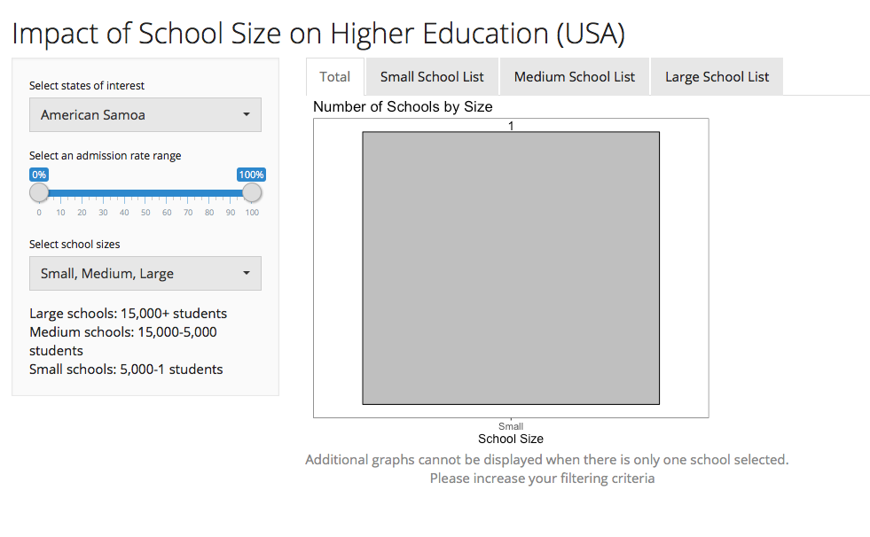
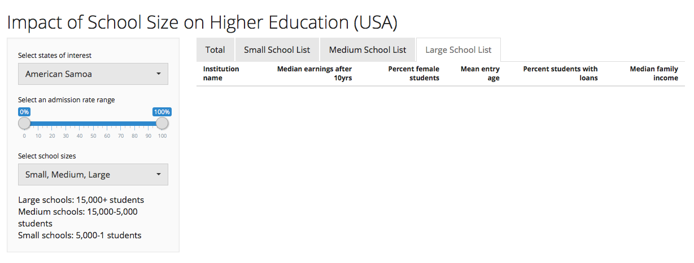
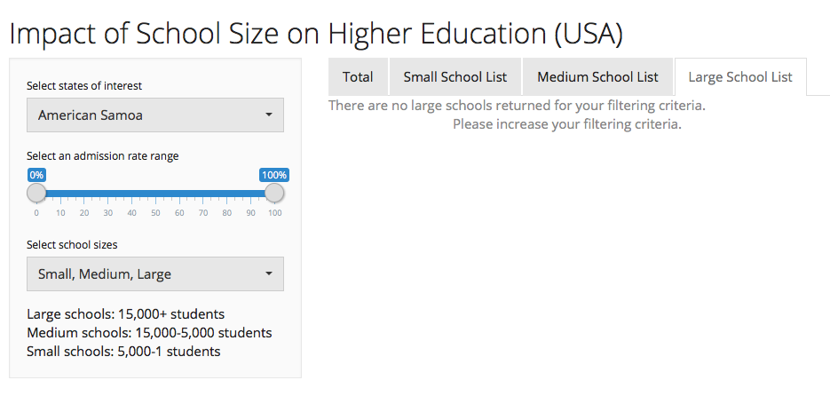

## Impact of School Size on Higher Education

Authors:  
[Sarah Watts](https://github.com/smwatts)   
[Socorro Dominguez](https://github.com/sedv8808)

### Milestone 4

#### Write Up

We decided to implement a few changes on our app based on previous received feedback. We decided to tackle an "Error Messaging" bug. 

The problem we faced was that under certain selections, there was not enough information to produce a plot. For example, when we had all filters de-selected, a red letter error message would appear on the server. Our users said this message was unappealing and it felt violent. Here are some screenshots to showcase our changes:

We also had error messages when the filtered information would only throw one data point. Most of our plots are distributions. So, if the selected data is just one observation, we couldn't do any plots and we had 5 empty uninformative squares. Now, we tell the user that the information just has one school selected and the other plots can't be done for these reasons.

Furthermore, when there were not enough selections, when we visited the tables' tabs, they were just empty so, it was confusing for the users to know if the page was loading or if there was nothing to be shown. We just added a legend to let the user know that there are were no data points to be shown in their selection

In our original data there were a lot of schools that did not have any information other than the name of the institution. At first we were considering leaving these points for the school counts' graph. However, we felt that this was inconsistent with our graphs: The counts graph was informing how many schools in total there where and the other graphs where just informing about a smaller subset of what we were reporting. We think the graphs of the distribution should only reflect the information of the schools we say are being counted. To be consistent with this selection, we also filtered our tables in order to just have the reported points. 

Other changes: We added the `number of counted schools` on top of the graph of "School count". We did this so that the user knows how many schools their selection chose and understands the density plots as a result of that number of schools.

### Changes if we were to made the app from scratch

If we started the app from scratch, we would have wanted to have some more feedback from prospective users: Maybe we would have reviewed the dataset in more detail. Then, interview a possible real client, explain them what the dataset was about and have them given us some real input on what they would need the app to inform them about and on the hows. Designing the app can be fun. However, we are not experts in the field of education (as counselours or ministries of education). We feel that having real input from the experts on what they want and what they need would give a great guiding.  We would also have created more functions at coding. This is some new expertise we learned from this experience. 

The greatest challenge we faced was learning to implement the different tricks and functions in Shiny. Learning how to use the themes and debugging the "error" messages, we didn't realized this was not a bug, but actually three bugs. 

We also made the code more intuitive and with more comments than it used to have. If anyone else where to walk through our app and improve the design or add new features (or change the graphs to reflect other information they want), they would be able to do that. 

## Wishlist
We fixed all the bugs that the app had and are happy about it. 

[Milestone 2](https://github.com/UBC-MDS/college_scorecard/releases/tag/V2.0)
[Proposal Release](https://github.com/UBC-MDS/college_scorecard/releases/tag/V1.0)